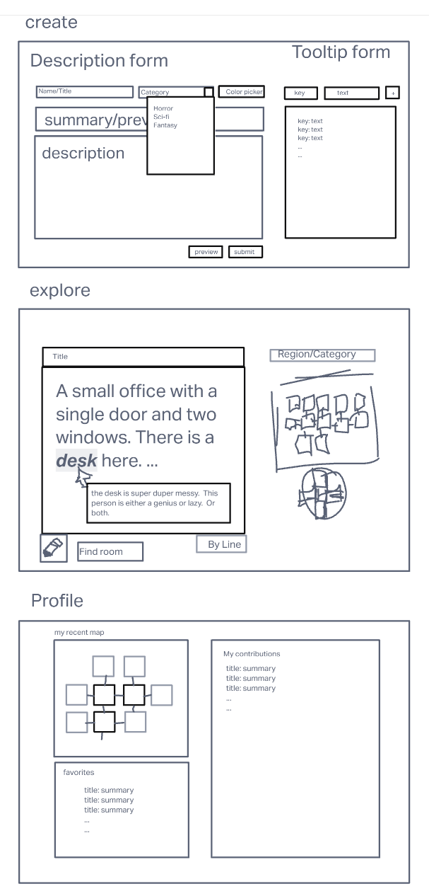
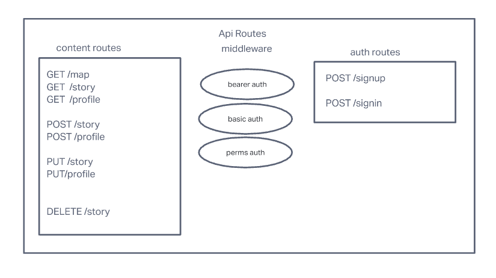
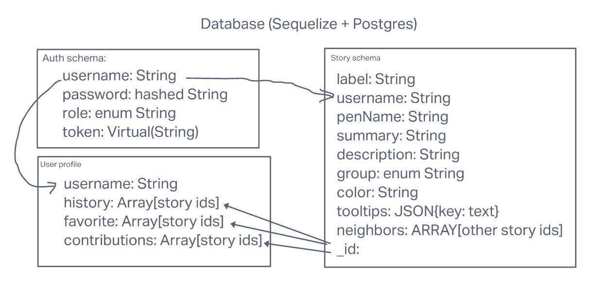
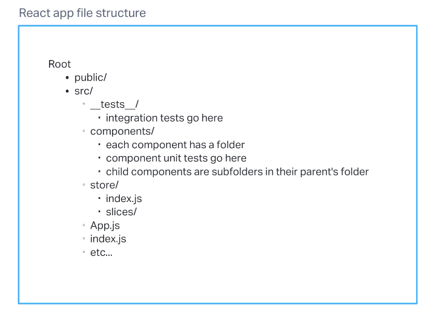

# Documents

## Initial Plans

1. [Team Agreement](team-agreement.md)
2. [Pitches](Pitches.md)
3. [UML](uml.png)
4. [Requirements](requirements.md)

## Planning Visuals

### Wireframes

### Routes

### Schemas

### File Structures

