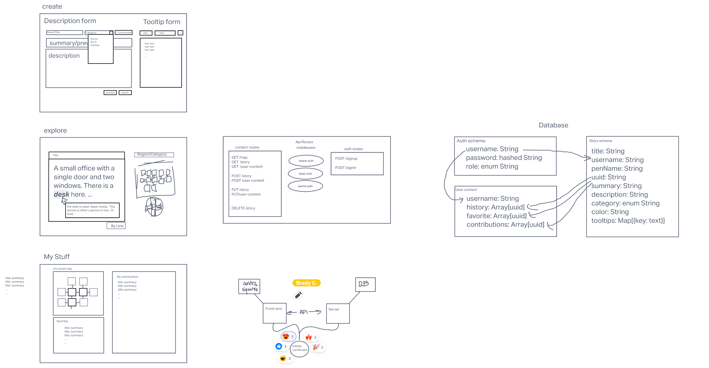

# Infinite Landscape - Requirements

## Vision

To provide a place to get lost in the creativity of others. Dive into someone else's imagination.

## Pain Point

Open collaborative spaces can be a source of inspiration and wonder. We hope to provide memorable, spontaneous experiences for both creators and exporers. There are many places *like* this elsewhere, but few combine these elements in one forum.

## Why should we care?

People love to place their mark in collaborative spaces. This provides a place for people of all skill levels to submit very short fictional exercises to flex their skills and show off their creativity. 

## Scope

### In
* It will host an assortment of creative descriptions, linked to one another in a graph
* It will consume and render API data from the server
* It will allow users to contribute stories to the graph
* It will allow users to log in/log out/sign up
* It will store user's recent history, contributions, and favorite places
* It will have an interface for reading and navigating stories
* It will allow users to edit their creations.

### Out
* It will not display pictures of places.
* It will not be a mobile app.
* It will not have public facing user pages.

## MVP

* Auth singin/signup
* Get story data from API for rendering
* Send story data to API to be integrated into the graph
* Edit story data.
* Navigate the graph in 4 directions.
* Personal Profile page showing:
  * recent exploration history
  * contributions    
  * favorites 
* Tooltips
  * Sub-descriptions
* Color picker for room
  * Dynamic styling based on room color.  
* Graphical display of map room connections.

## Stretch Goals
* User selects adjacent nodes for their contribution
* Tooltip:   
  * Nearby room previews
* Profile:
  * History graphical preview with adjacent unexplored vertices

## Functional Requirements

### Back-end
* GET /map
* GET /story
* GET /user-content

* POST /story
* POST /user-content

* PUT /story 
* PUT /user-content

* DELETE /story

* POST /signup
* POST /signin

* Graph data
* Story data
* User data

### Front End
* Explore page
* Create page
* User Content page 

## Non-Functional Requirements

* Automated jest testing for units and integration
* User data will be securely stored and protected from manipulation.
* Clean, professional, easy to use UI/UX

## Data Flow

